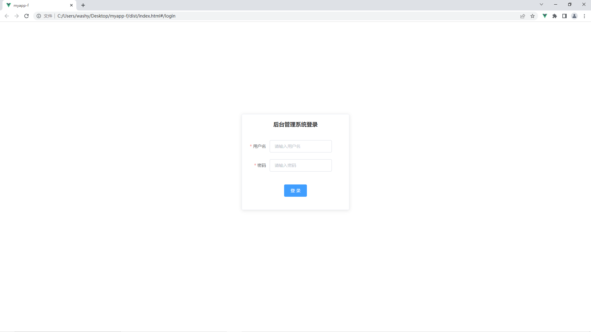
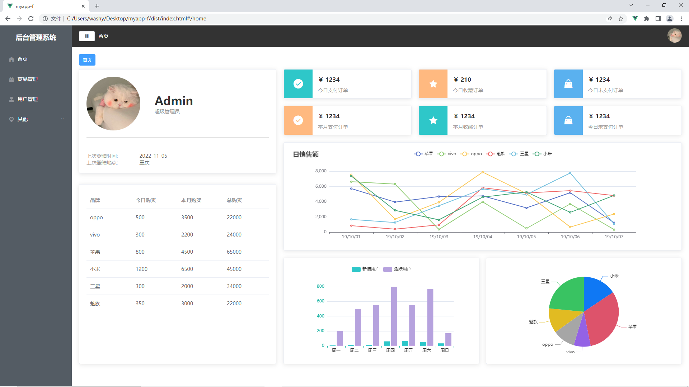

# 后台管理系统

## 基于vue2+vuex+elementui+mockjs+echarts打造

## 项目初始化
```
npm install
```

### 项目调试
```
npm run serve
```

### 项目打包
```
npm run build
```

### Lints and fixes files
```
npm run lint
```

## 账户权限
```
//管理员 admin 123456
//普通用户 washy 123456
```

## 界面截图

####  登录


#### 主页面


### Customize configuration
See [Configuration Reference](https://cli.vuejs.org/config/).
